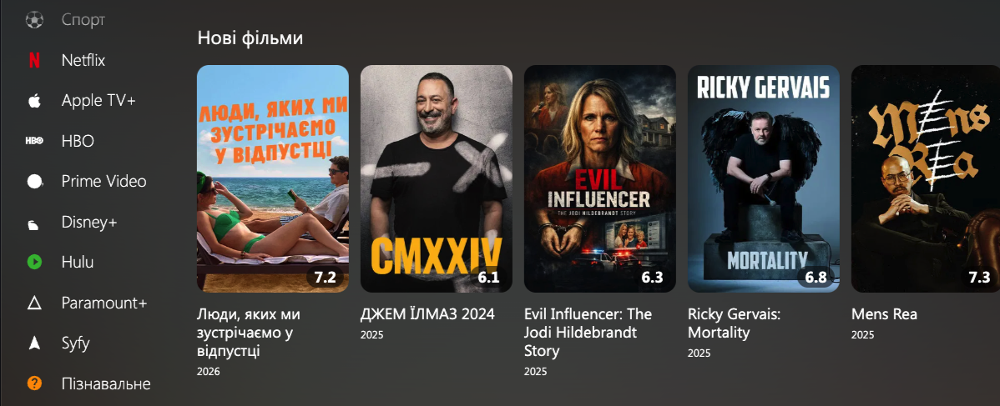
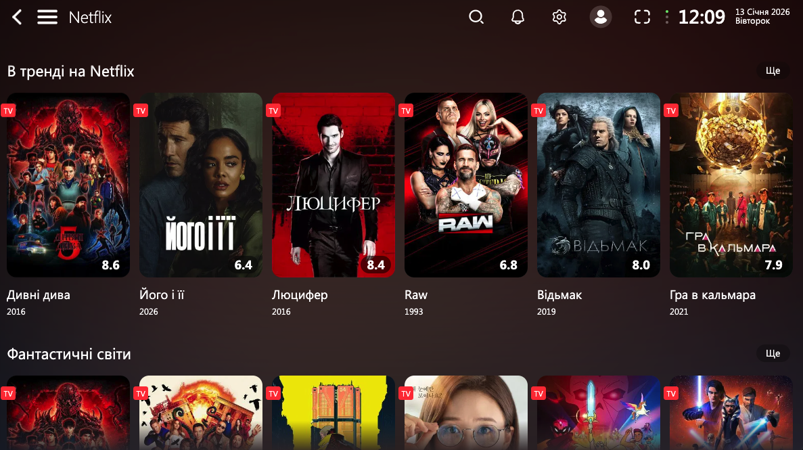
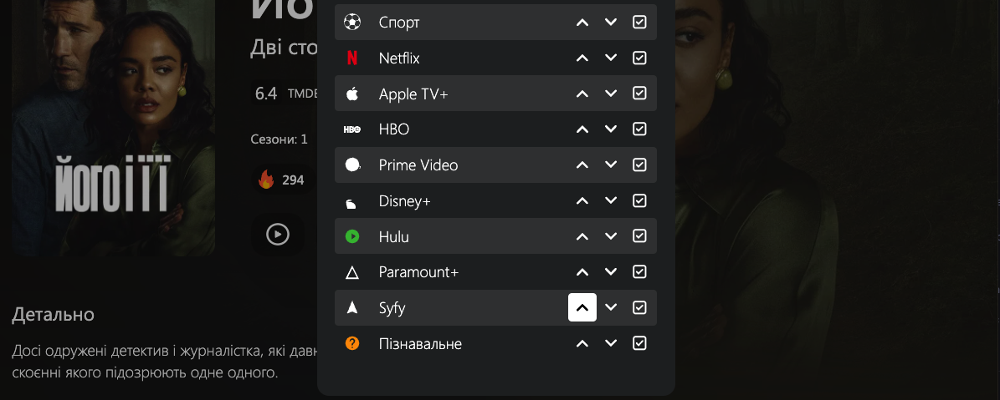

# 💡 Ліхтар (Likhtar) — Плагін для Lampa

[🇺🇦 Українська версія](#-опис) | [🇬🇧 English version](#-english-description)

---

### ⚠️ Disclaimer / Відмова від відповідальності

**UA**: Цей плагін є виключно каталогом контенту та агрегатором метаданих на основі TMDB API. Він **не містить**, не надає посилань та не сприяє перегляду піратського або будь-якого іншого нелегального відеоконтенту.

**EN**: This plugin is strictly a content catalog and metadata aggregator using the TMDB API. It **does not** host, provide links to, or facilitate the streaming of copyrighted, pirated, or illegal video content.

---

## 🇺🇦 Опис

**Ліхтар** — кастомна головна сторінка для [Lampa](https://github.com/lampa-app/lampa), що повністю замінює стандартний інтерфейс і додає преміальний досвід перегляду з фокусом на україномовний контент.

### ✨ Головні можливості

#### 🎬 Hero-секція
- Кінематографічний банер з автоматичним **TMDB-логотипом** замість текстової назви
- Відображення року, країни, вікового рейтингу та тривалості
- Розумна інверсія кольорів темних логотипів

#### 📺 Стрімінгові сервіси
- **Netflix** • **Apple TV+** • **HBO / Max** • **Prime Video** • **Disney+** • **Paramount+** • **Sky Showtime** • **Hulu** • **Syfy**
- Кожен сервіс має власні категорії (нові фільми, серіали, жанрові підбірки)
- Кнопка «На сторінку» з повним каталогом студії

#### 🎭 Кіно під настрій
- Підбірки за жанрами та настроєм для швидкого пошуку

#### 🏷️ Мітки якості та озвучки
- Автоматичне визначення **UA, 1080p, 4K, HDR** із торрент-джерел (JacRed)
- Фолбек на **Uaflix / Uakino** для перевірки українських озвучок
- Стилізовані градієнтні бейджі як на картках, так і на сторінці фільму
- Можливість вмикати/вимикати через налаштування

#### 📰 Кіноогляд
- YouTube-канали про кіно прямо в Lampa (Навколо Кіно, eKinoUA та інші)
- Налаштування списку каналів

#### 🇺🇦 Українська стрічка
- Окремий рядок з українським контентом

#### ⭐ Підписки на студії
- Підписуйтесь на улюблені виробничі компанії
- Окрема сторінка з новинками від підписаних студій

### ⚙️ Налаштування

Усі параметри доступні у вкладці **«Ліхтар»** у налаштуваннях Lampa:

| Параметр | Опис |
|---|---|
| Свій ключ TMDB | Використовувати власний API-ключ |
| Стрімінги | Увімкнути/вимкнути секцію стрімінгових сервісів |
| Кіно під настрій | Увімкнути/вимкнути жанрові підбірки |
| Мітки якості/озвучки | Увімкнути/вимкнути бейджі UA, 1080p, HDR |
| Логотип замість тексту | TMDB-логотип замість тексту в херо та на сторінці фільму |
| Кіноогляд | YouTube-канали про кіно у бічному меню |

### 🛠 Встановлення Ліхтаря

1. Відкрийте **Lampa** → **Налаштування** → **Плагіни** → **Додати плагін**
2. Введіть URL:
   ```
   https://syvyj.github.io/studios_4lampa/likhtar.js
   ```
3. Перезапустіть застосунок

---

## 🇬🇧 Likhtar — English Description

**Likhtar** is a custom home screen plugin for [Lampa](https://github.com/lampa-app/lampa) that replaces the default interface with a premium, cinema-style experience focused on Ukrainian content.

### ✨ Key Features

- **Hero Banner** — Cinematic slider with auto-fetched TMDB logos, release year, country, age rating, and runtime
- **10 Streaming Services** — Netflix, Apple TV+, HBO/Max, Prime Video, Disney+, Paramount+, Sky Showtime, Hulu, Syfy, Discovery, with genre-specific subcategories
- **Mood Cinema** — Genre and mood-based movie selections
- **Quality & Dubbing Badges** — Auto-detected UA, 1080p, 4K, HDR badges from JacRed torrent data with Uaflix/Uakino fallback
- **Kinoohlyad** — Integrated YouTube cinema channels (Ukrainian)
- **Studio Subscriptions** — Follow production companies and get personalized feeds
- **Full Customization** — All features togglable via the «Likhtar» settings tab

---
---

# Studios 4Lampa (Legacy)

[🇺🇦 Українська версія](#-опис-українською) | [🇬🇧 English version](#-english-description-1)

---



## 🇺🇦 Опис (Українською)

Уніфікований плагін для застосунку [Lampa](https://github.com/lampa-app/lampa), що об'єднує колекції провідних світових студій в єдиний зручний інтерфейс.



### 🚀 Можливості
- **Єдиний інтерфейс**: Доступ до всіх студій через основне меню сайдбару.
- **Глобальні колекції**: Netflix, Apple TV+, HBO, Disney+, Prime Video, Paramount+, Hulu та Syfy.
- **Пізнавальний контент**: Добірки від Discovery, National Geographic, BBC Earth та History.
- **Оптимізація для ТБ**: Спеціальна розмітка карток для зручного перегляду на великих екранах.



> [!TIP]
> Вимкнути або змінити порядок каталогів можна через стандартне налаштування «Редагування меню» в Lampa.

---

## 🇬🇧 English Description

Unified plugin for [Lampa](https://github.com/lampa-app/lampa) that integrates multiple streaming studio collections into one interface.


### 🚀 Features
- **Unified Interface**: Access all major studios from a single sidebar menu.
- **Global Studio Collections**:
  - **Netflix**: New movies, series, trends, and genre-specific rows.
  - **Apple TV+**: High-quality originals and hits.
  - **HBO / Max**: Warner Bros. blockbusters and premium dramas.
  - **Prime Video**: Trending Amazon originals and IMDb hits.
  - **Disney+**: MCU, Star Wars, Pixar, and Disney classics.
  - **Hulu**: Originals and highly-rated limited series.
  - **Paramount+**: Studio blockbusters and exclusive originals.
  - **Syfy**: Sci-fi and mystery collections.
- **Educational & Reality**: Curated content from Discovery, NatGeo, BBC Earth, etc.
- **Optimized for TV**: Wide-card layout for better browsing on large screens.


> [!TIP]
> You can disable or reorder catalogs via the standard "Menu Editing" setting in Lampa.

## 🛠 Installation / Встановлення

1. Open your Lampa application / Відкрийте застосунок Lampa.
2. Go to **Settings** -> **Plugins** / Перейдіть у **Налаштування** -> **Плагіни**.
3. Click **Add Plugin** / Натисніть **Додати плагін**.
4. Enter the URL of your hosted `studios.js` or use this link: `https://syvyj.github.io/studios_4lampa/studios.js` / Введіть URL-адресу вашого файлу `studios.js` або скористайтеся цим посиланням: `https://syvyj.github.io/studios_4lampa/studios.js`.
5. Restart the application / Перезапустіть застосунок.

## ✍️ Credits

Developed by **Syvyj**.
